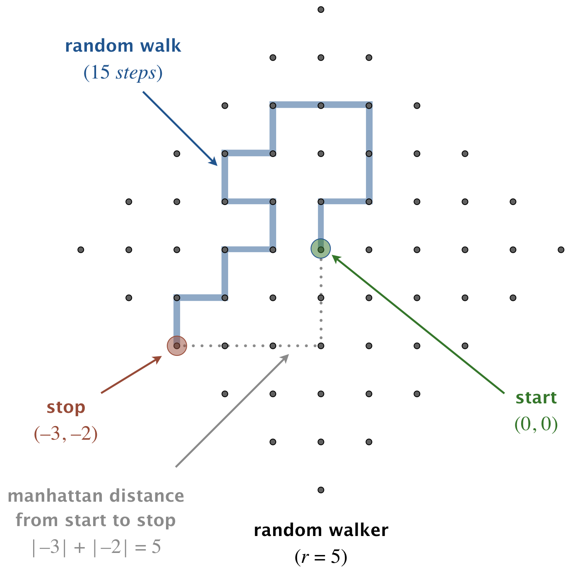

# 2D Random Walker Simulation

Random Walk Visualization
<blockquote>

</blockquote>


A Java implementation of a two-dimensional random walk process that continues until the walker reaches a specified distance from the origin.

## **Algorithm**
1. Starts at coordinate (0, 0)
2. At each step:
   - Randomly moves: North (↑), East (→), South (↓), or West (←)
   - Each direction has equal probability (25%)
3. Continues until Manhattan distance from origin equals `r`
   - Manhattan distance = |x| + |y|

## **Usage**
1. **Compile** the program:
   ```bash
   javac RandomWalker.java
   ```
2. **Run** with integer argument:
   ```bash
   java RandomWalker r
   ```
   - `r`: Target Manhattan distance (positive integer)

## **Example Output**
```bash
$ java RandomWalker 3
(0, 0)
(0, 1)
(-1, 1)
(-1, 0)
(-2, 0)
(-2, -1)
steps = 5
```

## **Implementation Details**
- Uses `Random` class for direction selection
- Tracks x and y coordinates separately
- Calculates Manhattan distance after each move
- Prints each coordinate visited
- Outputs total steps when target distance is reached
  

## **Notes**
- Each run produces different results (stochastic process)
- Average steps increase with larger `r` values
- Theoretical applications in multiple scientific domains
